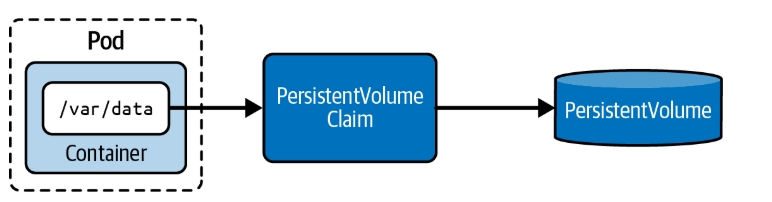
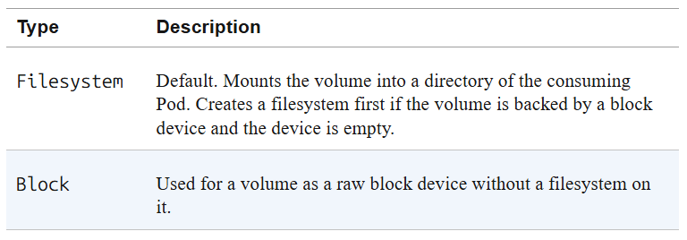
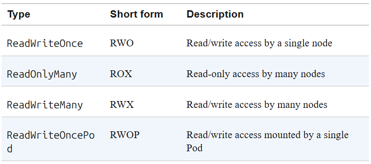
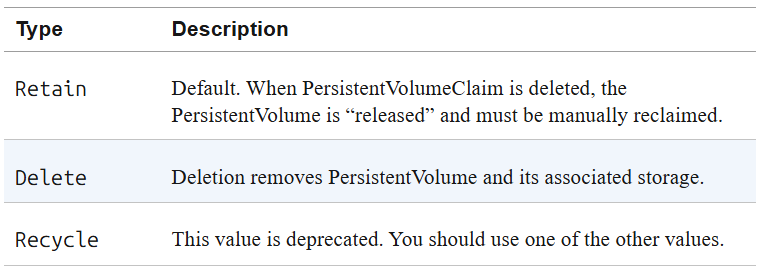

# Persistent Volumes

> **PV** (PersistentVolume) = la ressource de stockage physique, décorrélée du Pod.  
> **PVC** (PersistentVolumeClaim) = la demande de stockage qui fait le lien entre Pod et PV.  
> **StorageClass** = abstraction qui permet le provisionnement **dynamique** de PV.  
> Cycle : `PV créé` → `PVC demande` → `binding` → `Pod monte le PVC`.



---

## 1. Types de PersistentVolumes

| Type | Description |
|------|-------------|
| `hostPath` | Répertoire du node hôte. Dev/test uniquement, pas pour prod multi-node. |
| `local` | Stockage local (disque, partition). Perf > remote. Nécessite node affinity. |
| `nfs` | Partage NFS. Supporte `ReadWriteMany`. Partageable entre Pods/nodes. |
| `csi` | Interface standard pour les drivers de stockage modernes (AWS EBS, Azure Disk...). |
| `iscsi` | Stockage block-level sur réseau IP. |
| `fc` | Fibre Channel. Nécessite hardware FC. |

---

## 2. Provisionnement statique vs dynamique

| | Statique | Dynamique |
|--|---------|-----------|
| PV créé par | L'admin manuellement | Automatiquement par le provisioner |
| PVC `storageClassName` | `""` (vide) | Nom d'une StorageClass |
| Objet PV à créer | Oui | Non |

---

## 3. Créer un PersistentVolume (statique)

> PV = objet indépendant du Pod. Créé **uniquement en YAML** (pas de `kubectl create pv`).  
> Doit définir : `capacity`, `accessModes`, et le type de volume.

```yaml
# db-pv.yaml
apiVersion: v1
kind: PersistentVolume
metadata:
  name: db-pv
spec:
  capacity:
    storage: 1Gi                  # taille du stockage disponible
  accessModes:
    - ReadWriteOnce               # accès lecture/écriture par un seul node
  persistentVolumeReclaimPolicy: Retain  # que faire du PV quand le PVC est supprimé
  hostPath:
    path: /data/db                # répertoire sur le node hôte
```

```bash
# Créer le PV
kubectl apply -f db-pv.yaml

# Lister les PV (short: pv)
kubectl get pv db-pv

# Voir le volumeMode (Filesystem ou Block)
kubectl get pv -o wide

# Voir les accessModes en JSON
kubectl get pv db-pv -o jsonpath='{.spec.accessModes}'

# Voir la reclaim policy
kubectl get pv db-pv -o jsonpath='{.spec.persistentVolumeReclaimPolicy}'
```

---

## 4. Configuration d'un PersistentVolume

### Volume Mode

| Mode | Description |
|------|-------------|
| `Filesystem` | **Défaut**. Volume monté comme répertoire dans le Pod. |
| `Block` | Volume brut sans filesystem (usage avancé). |



### Access Modes

| Mode | Short | Description |
|------|-------|-------------|
| `ReadWriteOnce` | RWO | Lecture/écriture par **un seul node** |
| `ReadOnlyMany` | ROX | Lecture seule par **plusieurs nodes** |
| `ReadWriteMany` | RWX | Lecture/écriture par **plusieurs nodes** (nécessite NFS/EFS) |
| `ReadWriteOncePod` | RWOP | Lecture/écriture par **un seul Pod** (garantie plus forte que RWO) |



### Reclaim Policy

| Policy | Description |
|--------|-------------|
| `Retain` | **Défaut**. PV libéré mais données conservées. Reclaim manuel requis. |
| `Delete` | Supprime le PV ET le stockage sous-jacent. |
| `Recycle` | **Déprécié**. Ne pas utiliser. |



---

## 5. Node Affinity sur un PersistentVolume

> Obligatoire pour les volumes de type `local`.  
> Force le scheduling des Pods sur les nodes qui ont accès au stockage physique.

```yaml
# PV local avec node affinity
apiVersion: v1
kind: PersistentVolume
metadata:
  name: local-pv
spec:
  capacity:
    storage: 10Gi
  accessModes:
    - ReadWriteOnce
  persistentVolumeReclaimPolicy: Retain
  storageClassName: local-storage
  local:
    path: /mnt/data               # chemin sur le node physique
  nodeAffinity:
    required:
      nodeSelectorTerms:
      - matchExpressions:
        - key: kubernetes.io/hostname   # label du node
          operator: In
          values:
          - node01                      # PV accessible uniquement depuis node01
          - node02                      # ou node02
```

---

## 6. Créer un PersistentVolumeClaim (statique)

> PVC = demande de stockage. Kubernetes trouve automatiquement un PV compatible.  
> Critères de binding : `accessModes` compatibles + `capacity` suffisante + `storageClassName` identique.  
> `storageClassName: ""` = provisionnement statique (pas de StorageClass).

```yaml
# db-pvc.yaml
kind: PersistentVolumeClaim
apiVersion: v1
metadata:
  name: db-pvc
spec:
  accessModes:
    - ReadWriteOnce               # doit être compatible avec le PV
  storageClassName: ""            # "" = statique, pas de StorageClass
  resources:
    requests:
      storage: 256Mi              # taille minimale demandée au PV
```

```bash
# Créer le PVC
kubectl apply -f db-pvc.yaml

# Vérifier le binding (STATUS doit être Bound)
kubectl get pvc db-pvc

# Voir quel Pod utilise le PVC
kubectl describe pvc db-pvc | grep "Used By"
```

### Binding par nom (optionnel)

> Force le binding vers un PV spécifique, bypasse l'algorithme de matching automatique.

```yaml
apiVersion: v1
kind: PersistentVolumeClaim
metadata:
  name: specific-pvc
spec:
  volumeName: db-pv               # binding direct vers ce PV précis
  accessModes:
    - ReadWriteOnce
  resources:
    requests:
      storage: 1Gi
```

---

## 7. Monter un PVC dans un Pod

> Le Pod référence le PVC via `spec.volumes[].persistentVolumeClaim.claimName`.  
> Même mécanique que les volumes classiques : déclarer + monter.

```yaml
# app-consuming-pvc.yaml
apiVersion: v1
kind: Pod
metadata:
  name: app-consuming-pvc
spec:
  volumes:
  - name: app-storage
    persistentVolumeClaim:
      claimName: db-pvc           # nom du PVC à utiliser
  containers:
  - image: alpine:3.22.2
    name: app
    command: ["/bin/sh"]
    args: ["-c", "while true; do sleep 60; done;"]
    volumeMounts:
    - mountPath: "/mnt/data"      # chemin dans le container
      name: app-storage           # doit correspondre au nom du volume
```

```bash
# Créer le Pod
kubectl apply -f app-consuming-pvc.yaml

# Vérifier que le Pod est Running
kubectl get pods

# Vérifier les détails du volume monté
kubectl describe pod app-consuming-pvc | grep -A 5 Volumes

# Vérifier que le PVC indique bien le Pod qui l'utilise
kubectl describe pvc db-pvc | grep "Used By"

# Ouvrir un shell et tester l'accès au stockage
kubectl exec app-consuming-pvc -it -- /bin/sh
cd /mnt/data
touch test.db
ls -l
exit
```

---

## 8. StorageClass — Provisionnement dynamique

> StorageClass = définit un "type" de stockage + son provisioner.  
> Le provisioner crée automatiquement le PV quand un PVC le demande.  
> Pas besoin de créer le PV manuellement.

```bash
# Voir les StorageClasses disponibles (minikube crée "standard" par défaut)
kubectl get storageclass
```

### Créer une StorageClass

```yaml
# fast-sc.yaml
apiVersion: storage.k8s.io/v1
kind: StorageClass
metadata:
  name: fast
provisioner: kubernetes.io/gce-pd     # provisioner cloud (GCE ici)
parameters:
  type: pd-ssd                        # type de disque spécifique au provisioner
  replication-type: regional-pd       # paramètre spécifique au provisioner
```

```bash
# Créer la StorageClass
kubectl create -f fast-sc.yaml

# Lister les StorageClasses
kubectl get storageclass
```

### Utiliser une StorageClass dans un PVC (provisionnement dynamique)

```yaml
# db-pvc-dynamic.yaml
kind: PersistentVolumeClaim
apiVersion: v1
metadata:
  name: db-pvc
spec:
  accessModes:
    - ReadWriteOnce
  resources:
    requests:
      storage: 512Mi
  storageClassName: standard          # déclenche le provisionnement dynamique
                                      # le PV sera créé automatiquement
```

```bash
# Créer le PVC dynamique
kubectl apply -f db-pvc-dynamic.yaml

# Vérifier PV et PVC créés (le PV a un nom généré automatiquement avec hash)
kubectl get pv,pvc
```

---

## Exercices & Solutions

---

### Exercice 1 — PV + PVC + Pod (statique)

**Énoncé :**  
Créer un PV `logs-pv` sur `/var/logs` avec accès `ReadWriteOnce` et `ReadOnlyMany`, capacité 5Gi.  
Créer un PVC `logs-pvc` avec `ReadWriteOnce` et 2Gi.  
Monter le PVC dans un Pod `nginx` sur `/var/log/nginx`.  
Créer `/var/log/nginx/my-nginx.log`. Supprimer et recréer le Pod. Vérifier que le fichier persiste.

---

**Solution**

```yaml
# logs-pv.yaml
apiVersion: v1
kind: PersistentVolume
metadata:
  name: logs-pv
spec:
  capacity:
    storage: 5Gi                      # capacité totale du PV
  accessModes:
    - ReadWriteOnce                   # accès RW par un seul node
    - ReadOnlyMany                    # accès RO par plusieurs nodes
  hostPath:
    path: /var/logs                   # répertoire sur le node hôte
```

```yaml
# logs-pvc.yaml
kind: PersistentVolumeClaim
apiVersion: v1
metadata:
  name: logs-pvc
spec:
  accessModes:
    - ReadWriteOnce                   # doit être inclus dans les accessModes du PV
  storageClassName: ""                # statique : pas de StorageClass
  resources:
    requests:
      storage: 2Gi                    # inférieur ou égal à la capacité du PV
```

```yaml
# nginx-pod.yaml
apiVersion: v1
kind: Pod
metadata:
  name: nginx-pod
spec:
  volumes:
  - name: logs-storage
    persistentVolumeClaim:
      claimName: logs-pvc             # référence le PVC
  containers:
  - name: nginx
    image: nginx
    volumeMounts:
    - mountPath: /var/log/nginx       # chemin dans le container
      name: logs-storage
```

```bash
# Créer le PV et vérifier qu'il est Available
kubectl apply -f logs-pv.yaml
kubectl get pv logs-pv                # STATUS = Available

# Créer le PVC et vérifier qu'il est Bound
kubectl apply -f logs-pvc.yaml
kubectl get pvc logs-pvc              # STATUS = Bound

# Créer le Pod
kubectl apply -f nginx-pod.yaml
kubectl get pods nginx-pod            # STATUS = Running

# Créer le fichier dans le container
kubectl exec nginx-pod -it -- /bin/sh
touch /var/log/nginx/my-nginx.log
exit

# Supprimer et recréer le Pod
kubectl delete pod nginx-pod
kubectl apply -f nginx-pod.yaml

# Vérifier que le fichier persiste (hostPath conserve les données)
kubectl exec nginx-pod -it -- /bin/sh
ls /var/log/nginx/                    # my-nginx.log doit être présent
exit
```

---

### Exercice 2 — Provisionnement dynamique avec StorageClass

**Énoncé :**  
Créer un PVC `db-pvc` dans le namespace `persistence` avec `ReadWriteOnce`, 10Mi, storageClass `local-path`.  
Vérifier que le PVC est en `Pending` (pas de PV encore).  
Créer un Pod `app-consuming-pvc` dans `persistence` avec `alpine:3.21.3` montant le PVC sur `/mnt/data`.  
Vérifier que le PV est créé dynamiquement. Créer `/mnt/data/test.db`.

---

**Solution**

```bash
# Créer le namespace
kubectl create namespace persistence
```

```yaml
# db-pvc.yaml
kind: PersistentVolumeClaim
apiVersion: v1
metadata:
  name: db-pvc
  namespace: persistence              # namespace obligatoire
spec:
  accessModes:
    - ReadWriteOnce
  resources:
    requests:
      storage: 10Mi
  storageClassName: local-path        # déclenche le provisionnement dynamique
```

```bash
# Créer le PVC
kubectl apply -f db-pvc.yaml

# Vérifier STATUS = Pending (pas de Pod → pas de PV créé encore)
kubectl get pvc db-pvc -n persistence
```

```yaml
# app-pod.yaml
apiVersion: v1
kind: Pod
metadata:
  name: app-consuming-pvc
  namespace: persistence
spec:
  volumes:
  - name: data-storage
    persistentVolumeClaim:
      claimName: db-pvc               # référence le PVC dynamique
  containers:
  - name: app
    image: alpine:3.21.3
    command: ["/bin/sh", "-c", "sleep infinity"]
    volumeMounts:
    - mountPath: /mnt/data
      name: data-storage
```

```bash
# Créer le Pod
kubectl apply -f app-pod.yaml

# Attendre que le Pod soit Running
kubectl get pods -n persistence

# Vérifier que le PV a été créé dynamiquement (nom avec hash)
kubectl get pv

# Vérifier que le PVC est maintenant Bound
kubectl get pvc db-pvc -n persistence

# Créer un fichier dans le volume
kubectl exec app-consuming-pvc -n persistence -it -- /bin/sh
touch /mnt/data/test.db
ls /mnt/data/
exit
```

---

## Points clés pour la CKA

| Concept | À retenir |
|---------|-----------|
| PV créé comment ? | YAML uniquement — pas de `kubectl create pv` |
| PVC statique | `storageClassName: ""` obligatoire pour éviter la StorageClass par défaut |
| PVC dynamique | `storageClassName: <nom>` → PV créé automatiquement par le provisioner |
| Binding | Automatique si accessModes + capacity compatibles. One-to-one (un PV = un PVC) |
| `volumeName` dans PVC | Force le binding vers un PV précis |
| Short-forms | `pv` = PersistentVolume, `pvc` = PersistentVolumeClaim |
| Status PV | `Available` → `Bound` → `Released` (après suppression du PVC) |
| Status PVC | `Pending` (pas de PV dispo ou Pod pas encore créé) → `Bound` |
| Node affinity PV | Obligatoire pour `local`, optionnel pour autres types |
| `hostPath` | Dev/test uniquement — données liées à un node spécifique |

---

## Pièges CKA

| Piège | Solution |
|-------|----------|
| PVC reste en `Pending` | Vérifier accessModes + capacity + storageClassName compatibles avec le PV |
| Oublier `storageClassName: ""` en statique | Sans ça, Kubernetes assigne la StorageClass par défaut |
| `ReadWriteMany` avec hostPath | Impossible — RWX nécessite NFS ou stockage distribué |
| PV en `Released` après suppression PVC | Le PV doit être reclaim manuellement (policy `Retain`) |
| `volumeName` dans PVC | Le PV doit être `Available`, capacity ≥ request, accessModes compatibles |
| Données perdues après suppression Pod | Normal si `emptyDir` — utiliser PV/PVC pour la persistance |
| PV dynamique pas créé | Le Pod doit exister pour déclencher le provisionnement (selon le `volumeBindingMode`) |
