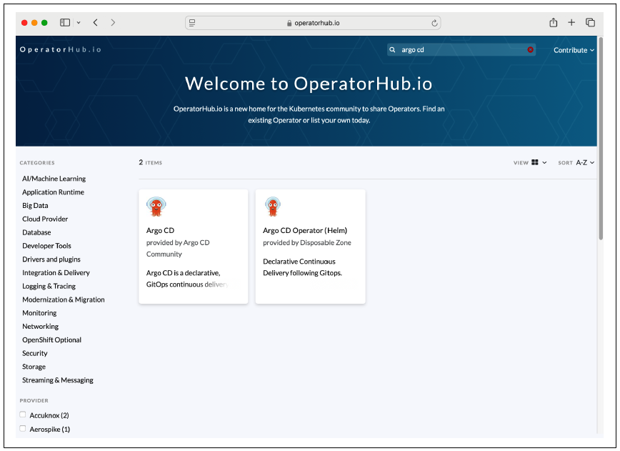
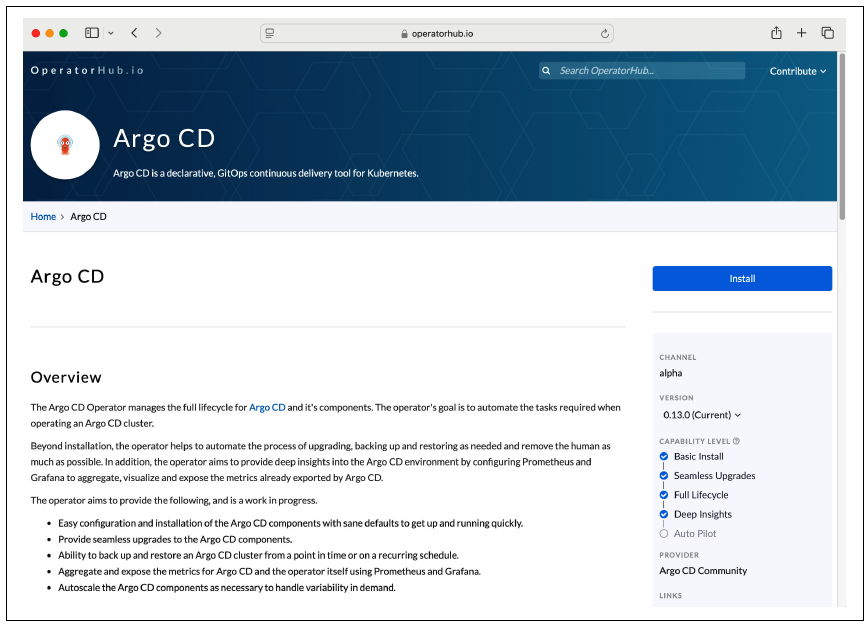
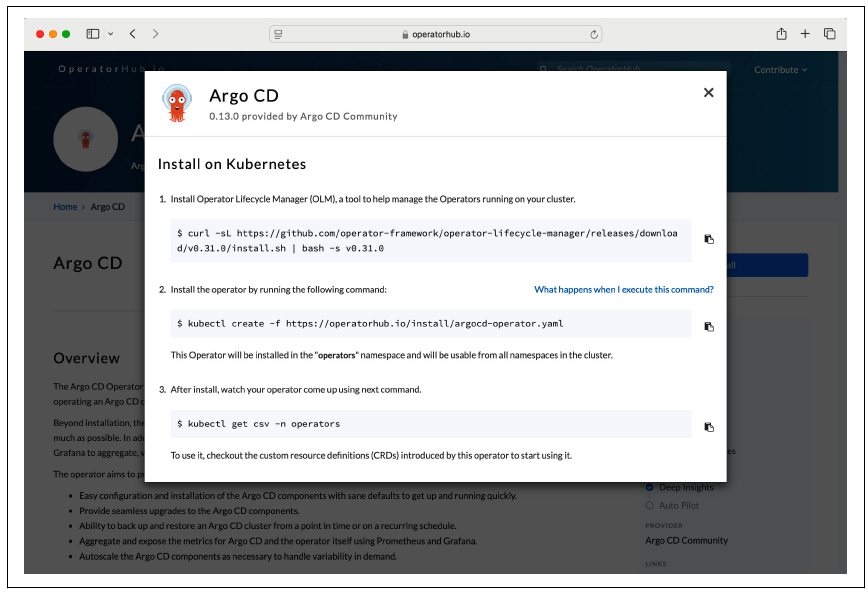

## 1. Concepts fondamentaux
 
Kubernetes propose un ensemble de primitives standard pour faire tourner des applications. Pour les cas d'usage personnalisés, il permet d'installer des **extensions** appelées **operators**.
 
- **CRD (Custom Resource Definition)** = mécanisme d'extension pour introduire de nouveaux types d'objets API non couverts par les primitives built-in.
- **CR (Custom Resource)** = instance concrète d'un CRD (comme un Pod est une instance de la définition "Pod").
- **Operator** = CRD(s) + Controller + souvent des règles RBAC.
### Le pattern Operator
 
| Composant | Rôle |
|---|---|
| **CRD** | Schéma / blueprint du custom object |
| **CR** | Instance de ce schéma |
| **Controller** | Logique de réconciliation qui surveille les CRs et agit en conséquence |
 
> Le controller interagit avec l'API Kubernetes et implémente la logique métier.  
> L'exam CKA **ne demande pas** d'implémenter un controller.
 
---
 
## 2. Découvrir des Operators
 
Les operators de la communauté sont disponibles sur :
- [OperatorHub.io](https://operatorhub.io)
- [Artifact Hub](https://artifacthub.io)
Exemples d'operators populaires :
 
| Operator | Usage |
|---|---|
| **External Secrets Operator** | Intégration avec AWS Secrets Manager, HashiCorp Vault... |
| **Crossplane** | Gestion de ressources cloud en syntaxe déclarative |
| **Argo CD Operator** | GitOps / déploiement continu synchronisé avec Git |
 
---
 
## 3. Installer un Operator (exemple : Argo CD)
 
### 3.1 Recherche sur OperatorHub.io
 
Rendez-vous sur [OperatorHub.io](https://operatorhub.io) et recherchez `argo cd`.
 

 
Cliquez sur le panel **Argo CD** pour accéder aux détails de l'operator.
 

 
La page décrit les CRDs fournies et le bouton **Install** affiche les instructions d'installation.
 

 
### 3.2 Installer OLM (Operator Lifecycle Manager)
 
OLM est un outil pour gérer les operators sur le cluster. C'est une **opération unique** :
 
```bash
curl -sL https://github.com/operator-framework/operator-lifecycle-manager/\
releases/download/v0.31.0/install.sh | bash -s v0.31.0
```
 
### 3.3 Installer l'Argo CD Operator
 
```bash
# Installe l'operator dans le namespace "operators"
kubectl create -f https://operatorhub.io/install/argocd-operator.yaml
# → subscription.operators.coreos.com/my-argocd-operator created
```
 
### 3.4 Vérifier l'installation
 
```bash
kubectl get csv -n operators
```
 
```
NAME                      DISPLAY   VERSION   REPLACES                    PHASE
argocd-operator.v0.13.0   Argo CD   0.13.0    argocd-operator.v0.12.0    Succeeded
```
 
> Le statut `Succeeded` confirme que l'operator est installé et prêt.
 
---
 
## 4. Travailler avec les CRDs
 
### 4.1 Lister les CRDs installées
 
```bash
kubectl get crds
```
 
```
NAME                                    CREATED AT
applications.argoproj.io                2025-03-21T23:02:40Z
applicationsets.argoproj.io             2025-03-21T23:02:39Z
appprojects.argoproj.io                 2025-03-21T23:02:39Z
argocdexports.argoproj.io               2025-03-21T23:02:39Z
argocds.argoproj.io                     2025-03-21T23:02:39Z
notificationsconfigurations.argoproj.io 2025-03-21T23:02:39Z
```
 
CRDs fournies par l'Argo CD Operator :
 
| CRD | Description |
|---|---|
| `Application` | Groupe de ressources Kubernetes définies par un manifest Git |
| `ApplicationSet` | Groupe/set de ressources Application |
| `AppProject` | Groupement logique définissant les repos Git, clusters et namespaces accessibles (multi-tenancy) |
 
### 4.2 Inspecter le schéma d'une CRD
 
```bash
# Affiche le kind, API group/version et les propriétés du schéma
kubectl describe crd applications.argoproj.io
```
 
---
 
## 5. Créer et interagir avec une CR
 
### 5.1 Créer une CR (instance de la CRD Application)
 
```yaml
# nginx-application.yaml
apiVersion: argoproj.io/v1alpha1
kind: Application
metadata:
  name: nginx
spec:
  project: default
  source:
    repoURL: https://github.com/bmuschko/cka-study-guide.git
    targetRevision: HEAD
    path: ./ch07/nginx
  destination:
    server: https://kubernetes.default.svc
    namespace: default
```
 
```bash
kubectl apply -f nginx-application.yaml
# → application.argoproj.io/nginx created
```
 
### 5.2 Opérations CRUD sur une CR
 
```bash
# Lire / décrire
kubectl describe application nginx
 
# Lister toutes les applications
kubectl get applications
 
# Supprimer
kubectl delete application nginx
# → application.argoproj.io "nginx" deleted
```
 
> Les CRs se manipulent exactement comme n'importe quel objet Kubernetes natif.
 
---
 
## 6. Inspecter le Controller
 
Le controller de l'Argo CD Operator tourne dans un Pod géré par un Deployment dans le namespace `operators` :
 
```bash
kubectl get deployments,pods -n operators
```
 
```
NAME                                                READY   UP-TO-DATE
deployment.apps/argocd-operator-controller-manager  1/1     1
 
NAME                                                        READY   STATUS
pod/argocd-operator-controller-manager-6998544bff-zx8bg     1/1     Running
```
 
> Le controller surveille en permanence l'état des CRs et déclenche les actions nécessaires (déploiement, mise à jour, suppression...).  
> On peut scaler le Deployment selon les besoins.
 
---
 
## Résumé
 
| Concept | Définition |
|---|---|
| **CRD** | Schéma qui définit un nouveau type d'objet Kubernetes |
| **CR** | Instance concrète d'une CRD |
| **Controller** | Processus de réconciliation qui agit sur les CRs |
| **Operator** | CRD + Controller (+ RBAC) = pattern complet |
| **OLM** | Outil pour installer et gérer les operators sur le cluster |
 
> **Piège CKA** : Une CRD sans controller n'est qu'un schéma de données — elle ne fait rien par elle-même. C'est le controller qui lui donne de la valeur.
