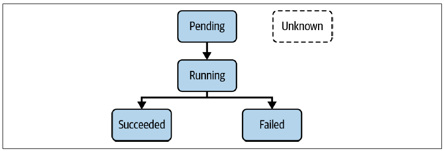

## 1. Concepts fondamentaux
 
Le **Pod** est la primitive la plus importante de l'API Kubernetes. Il encapsule un ou plusieurs containers qui partagent le même réseau et les mêmes volumes.
 
### Cas d'usage multi-containers
 
| Pattern | Description |
|---|---|
| **Sidecar** | Collecte de logs, agents de monitoring |
| **Adapter** | Standardisation des formats de sortie |
| **Ambassador** | Proxy de connexions réseau |
| **Init container** | Tâches de setup avant le démarrage du container principal |
 
> En pratique, la majorité des Pods contiennent **un seul container**.
 
---
 
## 2. Créer un Pod
 
### Approche impérative
 
```bash
# Créer un Pod avec image, port, variable d'env et labels
kubectl run hazelcast \
  --image=hazelcast/hazelcast:5.1.7 \
  --port=5701 \
  --env="DNS_DOMAIN=cluster" \
  --labels="app=hazelcast,env=prod"
```
 
Options importantes de `kubectl run` :
 
| Option | Exemple | Description |
|---|---|---|
| `--image` | `hazelcast/hazelcast:5.1.7` | Image du container |
| `--port` | `5701` | Port exposé par le container |
| `--env` | `DNS_DOMAIN=cluster` | Variable d'environnement |
| `--labels` | `app=hazelcast,env=prod` | Labels (séparés par virgule) |
| `--rm` | `true` | Supprime le Pod après exécution |
| `--restart` | `Never` | Politique de redémarrage |
 
### Approche déclarative
 
```yaml
# pod.yaml
apiVersion: v1
kind: Pod
metadata:
  name: hazelcast         # nom du Pod
  labels:
    app: hazelcast
    env: prod
spec:
  containers:
  - name: hazelcast
    image: hazelcast/hazelcast:5.1.7   # image du container
    env:
    - name: DNS_DOMAIN
      value: cluster                    # variable d'environnement
    ports:
    - containerPort: 5701               # port exposé
```
 
```bash
kubectl apply -f pod.yaml
# → pod/hazelcast created
```
 
---
 
## 3. Lister et inspecter des Pods
 
```bash
# Lister tous les Pods du namespace courant
kubectl get pods
 
# Lister un Pod spécifique par nom
kubectl get pods hazelcast
 
# Lister avec infos étendues (IP, node...)
kubectl get pods -o wide
 
# Filtrer par label (méthode Kubernetes-native)
kubectl get pods -l app=hazelcast
 
# Filtrer avec grep (utile pour les Pods de Deployments avec suffix généré)
kubectl get pods | grep nginx
 
# Tous les namespaces
kubectl get pods -A
```
 
---
 
## 4. Cycle de vie d'un Pod
 
Un Pod passe par plusieurs phases depuis sa création :
 

 
| Phase | Description |
|---|---|
| `Pending` | Pod accepté par Kubernetes, mais image(s) pas encore téléchargée(s) |
| `Running` | Au moins un container est en cours d'exécution |
| `Succeeded` | Tous les containers ont terminé avec succès |
| `Failed` | Au moins un container a terminé avec une erreur |
| `Unknown` | L'état du Pod ne peut pas être obtenu |
 
> Ne pas confondre les **phases du Pod** avec les **états des containers** : `Waiting`, `Running`, `Terminated`.
 
---
 
## 5. Politique de redémarrage
 
Configurable via `spec.restartPolicy` (valeur par défaut : `Always`) :
 
| Valeur | Comportement |
|---|---|
| `Always` | Redémarre le container après toute terminaison |
| `OnFailure` | Redémarre uniquement si exit code non-zero |
| `Never` | Ne redémarre jamais |
 
```yaml
apiVersion: v1
kind: Pod
metadata:
  name: hazelcast
spec:
  restartPolicy: Never    # ← ici
  containers:
  - name: hazelcast
    image: hazelcast/hazelcast:5.1.7
```
 
> Les **sidecar containers** nécessitent `restartPolicy: Always` défini explicitement.
 
---
 
## 6. Inspecter un Pod en détail
 
```bash
# Affiche toutes les infos : metadata, containers, events
kubectl describe pods hazelcast
 
# Filtrer une info précise avec grep
kubectl describe pods hazelcast | grep Image:
# → Image: hazelcast/hazelcast:5.1.7
```
 
---
 
## 7. Accéder aux logs
 
```bash
# Afficher les logs du container
kubectl logs hazelcast
 
# Streamer les logs en temps réel
kubectl logs hazelcast -f
 
# Logs du container précédent (après un redémarrage)
kubectl logs hazelcast -p
 
# Logs d'un container spécifique dans un Pod multi-container
kubectl logs hazelcast -c <nom-container>
```
 
---
 
## 8. Exécuter une commande dans un container
 
```bash
# Ouvrir un shell interactif dans le container
kubectl exec -it hazelcast -- /bin/sh
 
# Exécuter une commande unique sans shell interactif
kubectl exec hazelcast -- env
```
 
> Les `--` séparent les options de `kubectl exec` de la commande à exécuter dans le container.
 
---
 
## 9. Pod temporaire
 
Utile pour le debugging — le Pod est automatiquement supprimé après l'exécution :
 
```bash
kubectl run busybox \
  --image=busybox:1.36.1 \
  --rm -it \
  --restart=Never \
  -- env
# → affiche les variables d'env puis supprime le Pod
# → pod "busybox" deleted
```
 
---
 
## 10. IP d'un Pod et communication réseau
 
Chaque Pod reçoit une IP unique lors de sa création, routable depuis tous les nœuds et namespaces.
 
```bash
# Créer un Pod nginx
kubectl run nginx --image=nginx:1.25.1 --port=80
 
# Récupérer l'IP du Pod
kubectl get pod nginx -o wide
# → 10.244.0.5
 
# Ou via YAML
kubectl get pod nginx -o yaml
# status.podIP: 10.244.0.5
 
# Tester la connectivité depuis un Pod temporaire
kubectl run busybox \
  --image=busybox:1.36.1 \
  --rm -it \
  --restart=Never \
  -- wget 10.244.0.5:80
```
 
---
 
## 11. Variables d'environnement
 
```yaml
apiVersion: v1
kind: Pod
metadata:
  name: spring-boot-app
spec:
  containers:
  - name: spring-boot-app
    image: springio/gs-spring-boot-docker
    env:
    - name: SPRING_PROFILES_ACTIVE   # convention : MAJUSCULES + underscore
      value: dev
    - name: VERSION
      value: '1.5.3'
```
 
> Ne pas créer une image par environnement — injecter la config via des variables d'env (principe Twelve-Factor App).
 
---
 
## 12. Commande et arguments
 
`command` remplace l'`ENTRYPOINT` de l'image, `args` remplace le `CMD`.
 
```bash
# Générer le YAML avec dry-run
kubectl run mypod --image=busybox:1.36.1 -o yaml --dry-run=client \
  -- /bin/sh -c "while true; do date; sleep 10; done" > pod.yaml
```
 
```yaml
# Avec args uniquement
apiVersion: v1
kind: Pod
metadata:
  name: mypod
spec:
  containers:
  - name: mypod
    image: busybox:1.36.1
    args:
    - /bin/sh
    - -c
    - while true; do date; sleep 10; done
```
 
```yaml
# Avec command + args
spec:
  containers:
  - name: mypod
    image: busybox:1.36.1
    command: ["/bin/sh"]
    args: ["-c", "while true; do date; sleep 10; done"]
```
 
```bash
# Vérifier que la commande tourne bien
kubectl apply -f pod.yaml
kubectl logs mypod -f
```
 
---
 
## 13. Supprimer un Pod
 
```bash
# Suppression normale (attend le grace period : 5-30s)
kubectl delete pod hazelcast
 
# Suppression via le manifest
kubectl delete -f pod.yaml
 
# Suppression immédiate (éviter en prod)
kubectl delete pod hazelcast --now
```
 
---
 
## 14. Namespaces
 
Les namespaces permettent d'**isoler logiquement** des objets et d'éviter les collisions de noms.
 
### Namespaces par défaut
 
```bash
kubectl get namespaces
# NAME              STATUS   AGE
# default           Active   157d   ← objets sans namespace explicite
# kube-node-lease   Active   157d   ← système Kubernetes
# kube-public       Active   157d   ← système Kubernetes
# kube-system       Active   157d   ← système Kubernetes
```
 
### Créer et utiliser un namespace
 
```bash
# Créer un namespace
kubectl create namespace code-red
 
# Créer un Pod dans ce namespace
kubectl run pod --image=nginx:1.25.1 -n code-red
 
# Lister les Pods du namespace
kubectl get pods -n code-red
```
 
```yaml
# Namespace en YAML
apiVersion: v1
kind: Namespace
metadata:
  name: code-red
```
 
### Définir un namespace permanent (évite de répéter `-n` à chaque commande)
 
```bash
# Définir le namespace courant
kubectl config set-context --current --namespace=code-red
 
# Vérifier
kubectl config view --minify | grep namespace:
# → namespace: code-red
 
# Revenir au namespace default
kubectl config set-context --current --namespace=default
```
 
### Supprimer un namespace
 
```bash
# Supprime le namespace ET tous ses objets (effet cascade)
kubectl delete namespace code-red
```
 
---
 
## Résumé des commandes clés
 
```bash
# Pods
kubectl run <nom> --image=<image> [options]
kubectl get pods [-n <ns>] [-l <label>] [-o wide]
kubectl describe pods <nom>
kubectl logs <nom> [-f] [-p] [-c <container>]
kubectl exec -it <nom> -- /bin/sh
kubectl exec <nom> -- <commande>
kubectl delete pod <nom> [--now]
 
# Namespaces
kubectl get namespaces
kubectl create namespace <nom>
kubectl config set-context --current --namespace=<nom>
kubectl delete namespace <nom>
```
 
---
 
## Exercices
 
### Exercice 1 — Pod nginx avec namespace, réseau et logs
 
**Solution :**
 
```bash
# 1. Créer le namespace j43
kubectl create namespace j43
 
# 2. Créer le Pod nginx dans le namespace j43
kubectl run nginx --image=nginx:1.17.10 --port=80 -n j43
 
# 3. Obtenir les détails du Pod (dont l'IP)
kubectl get pods nginx -n j43 -o wide
kubectl describe pods nginx -n j43
 
# 4. Pod temporaire pour tester la connectivité (remplacer <IP> par l'IP du Pod)
kubectl run busybox --image=busybox:1.36.1 --rm -it --restart=Never -n j43 \
  -- wget <IP>:80
# → index.html sauvegardé, réponse HTML affichée dans le terminal
 
# 5. Afficher les logs du container nginx
kubectl logs nginx -n j43
 
# 6. Ajouter les variables d'environnement au Pod nginx
#    (un Pod ne peut pas être modifié à chaud pour les env vars — supprimer et recréer)
kubectl delete pod nginx -n j43 --now
 
kubectl run nginx \
  --image=nginx:1.17.10 \
  --port=80 \
  --env="DB_URL=postgresql://mydb:5432" \
  --env="DB_USERNAME=admin" \
  -n j43
 
# Vérifier les variables d'env
kubectl exec nginx -n j43 -- env | grep DB
 
# 7. Ouvrir un shell dans le container et lister les fichiers
kubectl exec -it nginx -n j43 -- /bin/sh
# Dans le shell :
ls -l
exit
```
 
---
 
### Exercice 2 — Pod avec boucle finie puis infinie
 
#### Partie A — Boucle finie (10 itérations)
 
```yaml
# loop-pod.yaml
apiVersion: v1
kind: Pod
metadata:
  name: loop
  namespace: j43
spec:
  containers:
  - name: loop
    image: busybox:1.36.1
    command: ["/bin/sh"]
    args: ["-c", "for i in {1..10}; do echo \"Welcome $i times\"; done"]
  restartPolicy: Never
```
 
```bash
kubectl apply -f loop-pod.yaml
 
# Vérifier le statut
kubectl get pods loop -n j43
# → STATUS: Completed (la boucle a fini, le container s'est arrêté)
```
 
> Le statut `Completed` est normal — la commande a terminé et `restartPolicy: Never` empêche le redémarrage.
 
#### Partie B — Modifier en boucle infinie
 
```bash
kubectl edit pod loop -n j43
```
 
Modifier la section `args` :
 
```yaml
# Avant
args: ["-c", "for i in {1..10}; do echo \"Welcome $i times\"; done"]
 
# Après
args: ["-c", "while true; do date; sleep 5; done"]
```
 
> **Note** : `kubectl edit` ne permet pas de modifier `command`/`args` d'un Pod en cours d'exécution.  
> Il faut supprimer et recréer le Pod avec le manifest mis à jour :
 
```bash
kubectl delete pod loop -n j43 --now
kubectl apply -f loop-pod.yaml   # après modification du YAML
 
# Streamer les logs pour vérifier la boucle infinie
kubectl logs loop -n j43 -f
# → Fri May 29 00:49:06 UTC 2020
# → Fri May 29 00:49:11 UTC 2020
# → ...
 
# Inspecter les events et le statut du Pod
kubectl describe pod loop -n j43
```
