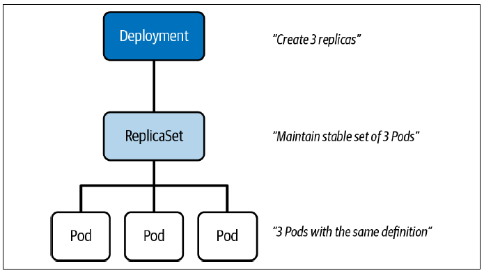
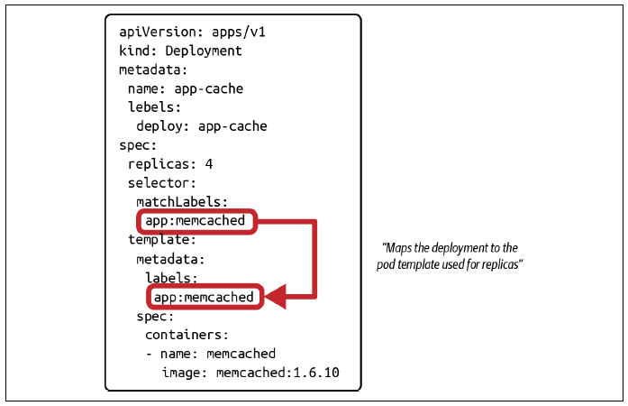
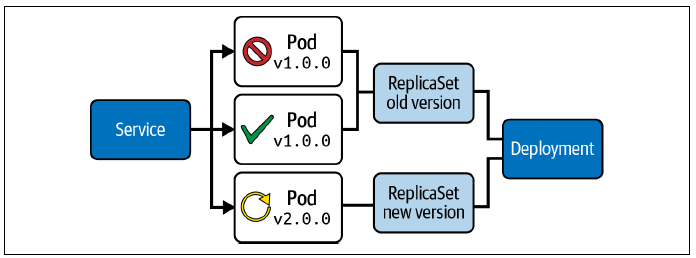

## 1. Concepts fondamentaux
 
Un Pod seul = **single point of failure**. Pour la scalabilité et la tolérance aux pannes, Kubernetes propose :
 
| Primitive | Rôle |
|---|---|
| **ReplicaSet** | Maintient un nombre défini de Pods identiques en fonctionnement |
| **Deployment** | Abstraction au-dessus du ReplicaSet — gère le cycle de vie complet (création, mise à jour, rollback) |
 

 
> En pratique, on ne manipule **jamais** le ReplicaSet directement — le Deployment le gère automatiquement.
 
---
 
## 2. Créer un Deployment
 
### Approche impérative
 
```bash
# Créer un Deployment avec 4 replicas
kubectl create deployment app-cache \
  --image=memcached:1.6.8 \
  --replicas=4
 
# → deployment.apps/app-cache created
```
 
### Approche déclarative
 
```yaml
# deployment.yaml
apiVersion: apps/v1
kind: Deployment
metadata:
  name: app-cache
  labels:
    app: app-cache          # label du Deployment lui-même (non utilisé pour la sélection)
spec:
  replicas: 4
  selector:
    matchLabels:
      app: app-cache        # ← doit correspondre exactement à spec.template.metadata.labels
  template:
    metadata:
      labels:
        app: app-cache      # ← doit correspondre exactement à spec.selector.matchLabels
    spec:
      containers:
      - name: memcached
        image: memcached:1.6.8
```
 
> **Piège** : `spec.selector.matchLabels` et `spec.template.metadata.labels` **doivent être identiques**.  
> Si les valeurs ne correspondent pas, la création échoue avec une erreur explicite.
 

 
```bash
kubectl apply -f deployment.yaml
```
 
---
 
## 3. Lister et inspecter
 
### Lister Deployments, ReplicaSets et Pods
 
```bash
# Lister les Deployments
kubectl get deployments
# NAME        READY   UP-TO-DATE   AVAILABLE   AGE
# app-cache   4/4     4            4           125m
```
 
| Colonne | Description |
|---|---|
| `READY` | `<prêts>/<désirés>` — nombre de replicas disponibles |
| `UP-TO-DATE` | Replicas mis à jour vers l'état désiré |
| `AVAILABLE` | Replicas disponibles pour les utilisateurs |
 
```bash
# Lister ReplicaSets et Pods (nommage par préfixe)
kubectl get replicasets,pods
# replicaset.apps/app-cache-596bc5586d   4   4   4   6h
# pod/app-cache-596bc5586d-84dkv         1/1 Running
# pod/app-cache-596bc5586d-8bzfs         1/1 Running
# pod/app-cache-596bc5586d-rc257         1/1 Running
# pod/app-cache-596bc5586d-tvm4d         1/1 Running
 
# Tous ensemble
kubectl get deployments,replicasets,pods
```
 
> Le nommage suit la convention : `<deployment>-<hash-replicaset>-<hash-pod>`.
 
### Inspecter un Deployment
 
```bash
kubectl describe deployment app-cache
# → Label selector, stratégie de déploiement, référence au ReplicaSet, events...
```
 
---
 
## 4. Auto-réparation (Self-Healing)
 
Le ReplicaSet remplace automatiquement tout Pod supprimé ou en échec pour maintenir le nombre de replicas désiré.
 
```bash
# Supprimer un Pod manuellement
kubectl delete pod app-cache-596bc5586d-rc257
 
# Quelques secondes après, un nouveau Pod est créé automatiquement
kubectl get pods
# pod/app-cache-596bc5586d-lwflz   1/1 Running   0   5s   ← nouveau Pod
```
 
---
 
## 5. Supprimer un Deployment
 
La suppression est **cascadante** : Deployment → ReplicaSet → Pods.
 
```bash
kubectl delete deployment app-cache
# → deployment.apps "app-cache" deleted
 
kubectl get deployments,replicasets,pods
# → No resources found in default namespace.
```
 
---
 
## 6. Mettre à jour un Deployment
 
Cinq méthodes disponibles :
 
```bash
# 1. Déclaratif (recommandé en production)
kubectl apply -f deployment.yaml
 
# 2. Édition interactive du live object
kubectl edit deployment web-server
 
# 3. Mise à jour de l'image uniquement (impératif)
kubectl set image deployment web-server nginx=nginx:1.25.2
 
# 4. Remplacement complet de l'objet
kubectl replace -f deployment.yaml
 
# 5. Patch JSON
kubectl patch deployment web-server \
  -p '{"spec":{"template":{"spec":{"containers":[{"name":"nginx","image":"nginx:1.25.2"}]}}}}'
```
 
---
 
## 7. Rolling Update (stratégie par défaut)
 
La stratégie **RollingUpdate** (aussi appelée "ramped") transite progressivement les replicas de l'ancienne vers la nouvelle version **par batches**, sans downtime.
 

 
```bash
# Mettre à jour l'image de memcached
kubectl set image deployment app-cache memcached=memcached:1.6.10
# → deployment.apps/app-cache image updated
 
# Suivre le status du rollout en cours
kubectl rollout status deployment app-cache
# → Waiting for rollout to finish: 2 out of 4 new replicas have been updated...
# → deployment "app-cache" successfully rolled out
```
 
> Pendant le rolling update, **deux versions coexistent** temporairement. À prendre en compte si l'API a des breaking changes.
 
### Stratégie alternative : Recreate
 
```yaml
spec:
  strategy:
    type: Recreate    # supprime TOUS les anciens Pods avant d'en créer de nouveaux → downtime possible
```
 
---
 
## 8. Historique des révisions
 
Chaque modification du Pod template crée une **nouvelle révision** dans l'historique.
 
```bash
# Consulter l'historique
kubectl rollout history deployment app-cache
# REVISION   CHANGE-CAUSE
# 1          <none>
# 2          <none>
 
# Détail d'une révision spécifique
kubectl rollout history deployment app-cache --revision=2
# → Image: memcached:1.6.10
```
 
> Par défaut, Kubernetes conserve **10 révisions maximum**.  
> Configurable via `spec.revisionHistoryLimit`.
 
### Ajouter une cause de changement
 
```bash
kubectl annotate deployment app-cache \
  kubernetes.io/change-cause="Image updated to 1.6.10"
 
kubectl rollout history deployment app-cache
# REVISION   CHANGE-CAUSE
# 1          <none>
# 2          Image updated to 1.6.10
```
 
---
 
## 9. Rollback
 
```bash
# Revenir à la révision précédente
kubectl rollout undo deployment app-cache
 
# Revenir à une révision spécifique
kubectl rollout undo deployment app-cache --to-revision=1
# → deployment.apps/app-cache rolled back
```
 
> **Important** : le rollback ne restaure **pas les données persistantes** — il revient uniquement sur le Pod template (`.spec.template`). Le nombre de replicas reste inchangé.
 
Après un rollback vers la révision 1, l'historique devient :
 
```
REVISION   CHANGE-CAUSE
2          Image updated to 1.6.10
3          <none>              ← l'ancienne révision 1 est renommée 3
```
 
---
 
## 10. Commandes de référence rapide
 
```bash
# Création
kubectl create deployment <nom> --image=<image> --replicas=<n>
 
# Inspection
kubectl get deployments
kubectl get deployments,replicasets,pods
kubectl describe deployment <nom>
 
# Mise à jour
kubectl set image deployment <nom> <container>=<image:tag>
kubectl edit deployment <nom>
kubectl apply -f deployment.yaml
 
# Rollout
kubectl rollout status deployment <nom>
kubectl rollout history deployment <nom>
kubectl rollout history deployment <nom> --revision=<n>
kubectl rollout undo deployment <nom> [--to-revision=<n>]
 
# Annotation
kubectl annotate deployment <nom> kubernetes.io/change-cause="<message>"
 
# Suppression
kubectl delete deployment <nom>
```
 
---
 
## 11. Exercices
 
### Exercice 1 — Corriger un Deployment mal configuré
 
Le fichier `fix-me-deployment.yaml` contient une erreur de configuration.  
L'erreur la plus fréquente dans ce type d'exercice est un **mismatch entre les labels**.
 
**Solution :**
 
```bash
# 1. Tenter de créer le Deployment
kubectl apply -f fix-me-deployment.yaml
# → The Deployment "fix-me" is invalid:
#   spec.template.metadata.labels: Invalid value: {...}
#   `selector` does not match template `labels`
```
 
```yaml
# fix-me-deployment.yaml — version corrigée
apiVersion: apps/v1
kind: Deployment
metadata:
  name: fix-me
spec:
  replicas: 3
  selector:
    matchLabels:
      app: fix-me       # ← doit correspondre à spec.template.metadata.labels
  template:
    metadata:
      labels:
        app: fix-me     # ← doit correspondre à spec.selector.matchLabels
    spec:
      containers:
      - name: nginx
        image: nginx:1.23.0
```
 
```bash
# 2. Appliquer le manifest corrigé
kubectl apply -f fix-me-deployment.yaml
# → deployment.apps/fix-me created
 
# 3. Vérifier
kubectl get deployment fix-me
# → READY 3/3
```
 
---
 
### Exercice 2 — Deployment nginx : création, update, rollback
 
**Solution :**
 
```bash
# 1. Créer le Deployment avec les labels demandés
kubectl create deployment nginx \
  --image=nginx:1.23.0 \
  --replicas=3
# Le Deployment utilise tier=backend et le Pod template app=v1
# → à faire en YAML car les labels custom nécessitent un manifest
```
 
```yaml
# nginx-deployment.yaml
apiVersion: apps/v1
kind: Deployment
metadata:
  name: nginx
  labels:
    tier: backend         # label du Deployment
spec:
  replicas: 3
  selector:
    matchLabels:
      app: v1
  template:
    metadata:
      labels:
        app: v1           # label du Pod template
    spec:
      containers:
      - name: nginx
        image: nginx:1.23.0
```
 
```bash
kubectl apply -f nginx-deployment.yaml
 
# 2. Vérifier le nombre de replicas
kubectl get deployment nginx
# → READY 3/3
 
# 3. Mettre à jour l'image vers nginx:1.23.4
kubectl set image deployment nginx nginx=nginx:1.23.4
# → deployment.apps/nginx image updated
 
# 4. Vérifier que le rollout est complet
kubectl rollout status deployment nginx
# → deployment "nginx" successfully rolled out
 
kubectl get pods
# → tous les Pods utilisent désormais nginx:1.23.4
 
# 5. Ajouter la cause de changement à la révision courante
kubectl annotate deployment nginx \
  kubernetes.io/change-cause="Pick up patch version"
 
# 6. Consulter l'historique
kubectl rollout history deployment nginx
# REVISION   CHANGE-CAUSE
# 1          <none>
# 2          Pick up patch version
 
# 7. Revenir à la révision 1
kubectl rollout undo deployment nginx --to-revision=1
# → deployment.apps/nginx rolled back
 
# 8. Vérifier que les Pods utilisent bien nginx:1.23.0
kubectl get pods -o jsonpath='{range .items[*]}{.spec.containers[0].image}{"\n"}{end}'
# → nginx:1.23.0
# → nginx:1.23.0
# → nginx:1.23.0
 
# Ou via describe
kubectl describe deployment nginx | grep Image:
# → Image: nginx:1.23.0
```
 
---
 
## Pièges CKA
 
| Piège | Solution |
|---|---|
| `selector.matchLabels` ≠ `template.metadata.labels` | Les deux **doivent être identiques** — sinon la création échoue |
| Supprimer un Pod géré par un ReplicaSet | Il sera **recréé automatiquement** — supprimer le Deployment pour vraiment supprimer les Pods |
| `kubectl rollout undo` restaure les données | **Faux** — seul le Pod template est rétabli, pas les données persistantes |
| Révision 1 disparaît après rollback | Normal — Kubernetes la renomme en révision N+1 pour éviter les doublons |
| `spec.revisionHistoryLimit` | Défaut = 10 révisions. À augmenter si on a besoin d'un historique plus long |
| Stratégie `Recreate` | Cause un **downtime** — tous les anciens Pods sont supprimés avant que les nouveaux soient créés |
