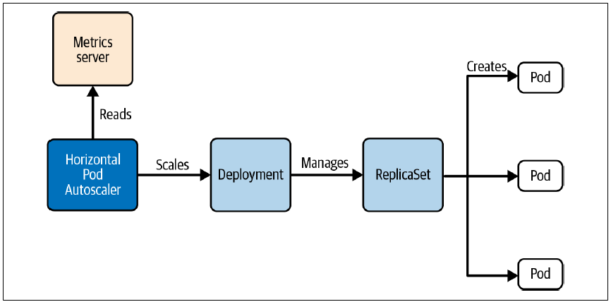
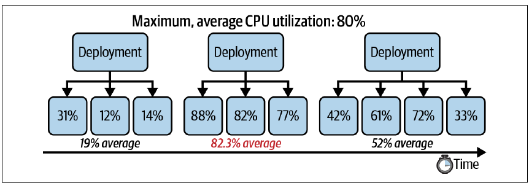

## 1. Concepts fondamentaux
 
| Type de scaling | Mécanisme | Primitive Kubernetes |
|---|---|---|
| **Vertical** | Augmenter les ressources (CPU/RAM) par Pod | VerticalPodAutoscaler (hors scope CKA) |
| **Horizontal** | Augmenter le nombre de Pods | `kubectl scale` / HorizontalPodAutoscaler |
 
---
 
## 2. Scaling manuel
 
### 2.1 Scaler un Deployment
 
```bash
# Augmenter le nombre de replicas à 6
kubectl scale deployment app-cache --replicas=6
# → deployment.apps/app-cache scaled
 
# Observer la création des Pods en temps réel
kubectl get pods -w
# app-cache-5d6748d8b9-6cc4j   0/1   ContainerCreating   0   11s
# app-cache-5d6748d8b9-6z7g5   0/1   ContainerCreating   0   11s
# app-cache-5d6748d8b9-6rmlj   1/1   Running             0   28m
# ...
```
 
> En production, privilégier la modification de `spec.replicas` dans le manifest YAML versionné, puis `kubectl apply`.
 
### 2.2 Scaler un StatefulSet
 
Le StatefulSet est conçu pour les applications **stateful** (ex: bases de données). Chaque replica a une **identité unique et persistante**.
 
```yaml
# redis.yaml
apiVersion: apps/v1
kind: StatefulSet
metadata:
  name: redis
spec:
  selector:
    matchLabels:
      app: redis
  replicas: 1
  serviceName: "redis"
  template:
    metadata:
      labels:
        app: redis
    spec:
      containers:
      - name: redis
        image: redis:6.2.5
        command: ["redis-server", "--appendonly", "yes"]
        ports:
        - containerPort: 6379
          name: web
        volumeMounts:
        - name: redis-vol
          mountPath: /data
  volumeClaimTemplates:
  - metadata:
      name: redis-vol
    spec:
      accessModes: ["ReadWriteOnce"]
      resources:
        requests:
          storage: 1Gi
```
 
```bash
kubectl apply -f redis.yaml
 
# Vérifier le StatefulSet (nommage séquentiel des Pods : redis-0, redis-1...)
kubectl get statefulset redis
# NAME    READY   AGE
# redis   1/1     2m10s
 
kubectl get pods
# NAME      READY   STATUS    RESTARTS   AGE
# redis-0   1/1     Running   0          2m
 
# Scaler à 3 replicas
kubectl scale statefulset redis --replicas=3
 
kubectl get pods
# NAME      READY   STATUS    RESTARTS   AGE
# redis-0   1/1     Running   0          101m
# redis-1   1/1     Running   0          97m
# redis-2   1/1     Running   0          97m
```
 
> **Important** : le scale down d'un StatefulSet nécessite que **tous les replicas soient en bonne santé**. Un Pod bloqué peut rendre l'application indisponible.
 
---
 
## 3. HorizontalPodAutoscaler (HPA)
 
L'HPA ajuste **automatiquement** le nombre de replicas en fonction de métriques de ressources (CPU, mémoire).
 

 
### 3.1 Prérequis
 
Trois conditions obligatoires pour que l'HPA fonctionne :
 
| Prérequis | Détail |
|---|---|
| **Metrics Server installé** | Sans lui, l'HPA ne peut pas récupérer les métriques |
| **Resource requests définies** | CPU → `requests.cpu` requis ; Mémoire → `requests.memory` requis |
| **Ressources cluster suffisantes** | Le cluster doit pouvoir scheduler de nouveaux Pods |
 
> Si les resource requests ne sont pas définies, la colonne `TARGETS` affiche `<unknown>`.
 
---
 
### 3.2 Créer un HPA
 
#### Approche impérative
 
```bash
# HPA basé sur CPU uniquement
kubectl autoscale deployment app-cache \
  --cpu-percent=80 \
  --min=3 \
  --max=5
# → horizontalpodautoscaler.autoscaling/app-cache autoscaled
```
 
#### Approche déclarative
 
```yaml
# hpa-cpu.yaml — HPA sur CPU uniquement
apiVersion: autoscaling/v2
kind: HorizontalPodAutoscaler
metadata:
  name: app-cache
spec:
  scaleTargetRef:
    apiVersion: apps/v1
    kind: Deployment
    name: app-cache         # Deployment ciblé
  minReplicas: 3            # nombre minimum de replicas
  maxReplicas: 5            # nombre maximum de replicas
  metrics:
  - type: Resource
    resource:
      name: cpu
      target:
        type: Utilization
        averageUtilization: 80    # seuil en %
```
 
#### HPA avec CPU + Mémoire
 
```yaml
# hpa-cpu-memory.yaml — HPA sur CPU et mémoire
apiVersion: autoscaling/v2
kind: HorizontalPodAutoscaler
metadata:
  name: app-cache
spec:
  scaleTargetRef:
    apiVersion: apps/v1
    kind: Deployment
    name: app-cache
  minReplicas: 3
  maxReplicas: 5
  metrics:
  - type: Resource
    resource:
      name: cpu
      target:
        type: Utilization
        averageUtilization: 80
  - type: Resource
    resource:
      name: memory
      target:
        type: AverageValue
        averageValue: 500Mi       # valeur absolue (pas un %)
```
 
#### Resource requests associées dans le Pod template
 
```yaml
# À définir dans spec.template.spec.containers du Deployment
resources:
  requests:
    cpu: 250m
    memory: 100Mi
  limits:
    cpu: 500m
    memory: 500Mi
```
 
---
 
### 3.3 Lister et inspecter les HPA
 
```bash
# Lister les HPA (alias : hpa)
kubectl get hpa
# NAME        REFERENCE               TARGETS         MINPODS   MAXPODS   REPLICAS   AGE
# app-cache   Deployment/app-cache    15%/80%         3         5         4          58s
 
# Si resource requests absentes :
# TARGETS → <unknown>/80%
 
# Avec CPU + mémoire :
# TARGETS → 1994752/500Mi, 0%/80%
 
# Détails complets (events de rescaling inclus)
kubectl describe hpa app-cache
```
 

 
> Le `describe` affiche les **events de rescaling** : quand le nombre de replicas a changé et pourquoi — très utile pour le troubleshooting.
 
---
 
## 4. Résumé des différences : scaling manuel vs automatique
 
| Critère | Manuel | HPA |
|---|---|---|
| Déclenchement | À la main | Automatique selon métriques |
| Réactivité | Limitée | Temps réel |
| Prérequis | Aucun | Metrics Server + resource requests |
| Ressources compatibles | Deployment, StatefulSet | Deployment, ReplicaSet, StatefulSet (pas les Pods standalone) |
| Usage recommandé | Tests, charges prévisibles | Production, charges variables |
 
---
 
## 5. Commandes de référence rapide
 
```bash
# Scaling manuel
kubectl scale deployment <nom> --replicas=<n>
kubectl scale statefulset <nom> --replicas=<n>
 
# HPA
kubectl autoscale deployment <nom> --cpu-percent=<n> --min=<n> --max=<n>
kubectl get hpa
kubectl describe hpa <nom>
kubectl delete hpa <nom>
 
# Observer le scaling en temps réel
kubectl get pods -w
```
 
---
 
## 6. Exercices
 
### Exercice 1 — Deployment et scaling manuel
 
**Solution :**
 
```yaml
# hello-world-deployment.yaml
apiVersion: apps/v1
kind: Deployment
metadata:
  name: hello-world
spec:
  replicas: 3
  selector:
    matchLabels:
      app: hello-world
  template:
    metadata:
      labels:
        app: hello-world
    spec:
      containers:
      - name: hello-world
        image: bmuschko/nodejs-hello-world:1.0.0
```
 
```bash
# 1. Créer le Deployment
kubectl apply -f hello-world-deployment.yaml
 
# Vérifier les 3 replicas
kubectl get deployment hello-world
# → READY 3/3
 
# 2. Modifier replicas: 3 → 8 dans hello-world-deployment.yaml
# (éditer le fichier : remplacer replicas: 3 par replicas: 8)
 
# Appliquer les changements
kubectl apply -f hello-world-deployment.yaml
 
# Vérifier les 8 replicas
kubectl get deployment hello-world
# → READY 8/8
 
kubectl get pods
# → 8 Pods en Running
```
 
---
 
### Exercice 2 — Deployment nginx + HPA CPU + mémoire
 
**Solution :**
 
```yaml
# nginx-deployment.yaml
apiVersion: apps/v1
kind: Deployment
metadata:
  name: nginx
spec:
  replicas: 1
  selector:
    matchLabels:
      app: nginx
  template:
    metadata:
      labels:
        app: nginx
    spec:
      containers:
      - name: nginx
        image: nginx:1.23.4
        resources:
          requests:
            cpu: "0.5"          # 500m
            memory: "500Mi"
          limits:
            memory: "500Mi"     # limit mémoire = request mémoire
```
 
```bash
# 1. Créer le Deployment
kubectl apply -f nginx-deployment.yaml
 
kubectl get deployment nginx
# → READY 1/1
```
 
```yaml
# nginx-hpa.yaml
apiVersion: autoscaling/v2
kind: HorizontalPodAutoscaler
metadata:
  name: nginx-hpa
spec:
  scaleTargetRef:
    apiVersion: apps/v1
    kind: Deployment
    name: nginx
  minReplicas: 3
  maxReplicas: 8
  metrics:
  - type: Resource
    resource:
      name: cpu
      target:
        type: Utilization
        averageUtilization: 75    # 75% CPU
  - type: Resource
    resource:
      name: memory
      target:
        type: Utilization
        averageUtilization: 60    # 60% mémoire
```
 
```bash
# 2. Créer le HPA
kubectl apply -f nginx-hpa.yaml
 
# 3. Inspecter le HPA
kubectl get hpa nginx-hpa
# NAME        REFERENCE           TARGETS                    MINPODS   MAXPODS   REPLICAS
# nginx-hpa   Deployment/nginx    <memory>%/60%, <cpu>%/75%  3         8         3
 
kubectl describe hpa nginx-hpa
# → Conditions, events de rescaling, métriques actuelles
```
 
> **Combien de replicas ?**  
> Sans charge applicative réelle, la consommation CPU et mémoire est très faible (en dessous des seuils de 75% et 60%). L'HPA va donc **scaler DOWN jusqu'au minimum** → **3 replicas** (la valeur de `minReplicas`).
 
---
 
## Pièges CKA
 
| Piège | Solution |
|---|---|
| HPA avec `TARGETS: <unknown>` | Les `resource requests` ne sont pas définies dans le Pod template |
| HPA sans Metrics Server | Installer le Metrics Server — sans lui l'HPA ne peut pas fonctionner |
| HPA sur un Pod standalone | **Impossible** — l'HPA ne supporte que Deployment, ReplicaSet, StatefulSet |
| Scale down StatefulSet avec Pod en erreur | Le scale down est bloqué — résoudre d'abord le problème du Pod |
| `averageUtilization` vs `averageValue` | CPU → `Utilization` (%) ; Mémoire → `AverageValue` (Mi) ou `Utilization` (%) |
| minReplicas non respecté | Si la charge est sous les seuils, l'HPA descend jusqu'à `minReplicas`, jamais en dessous |
